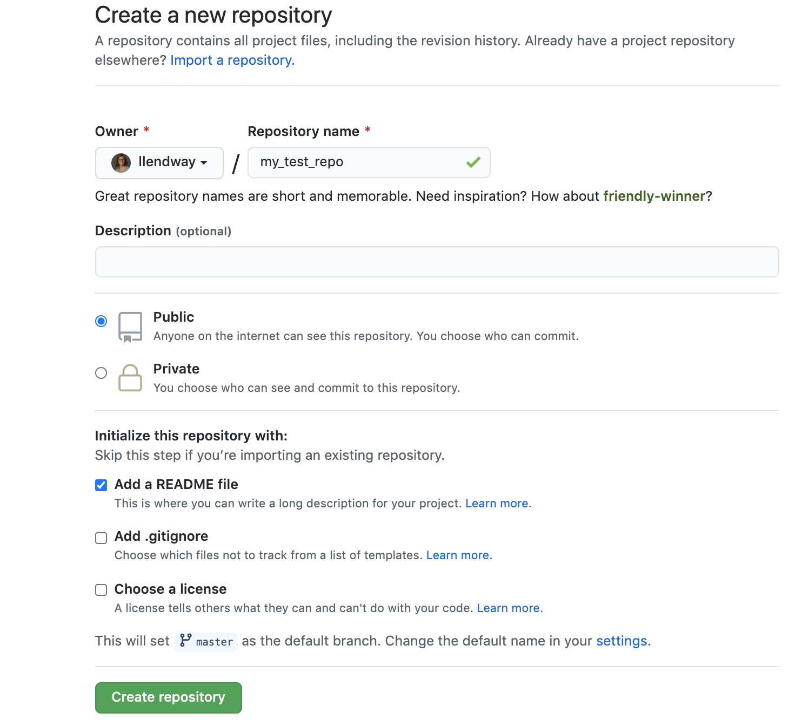
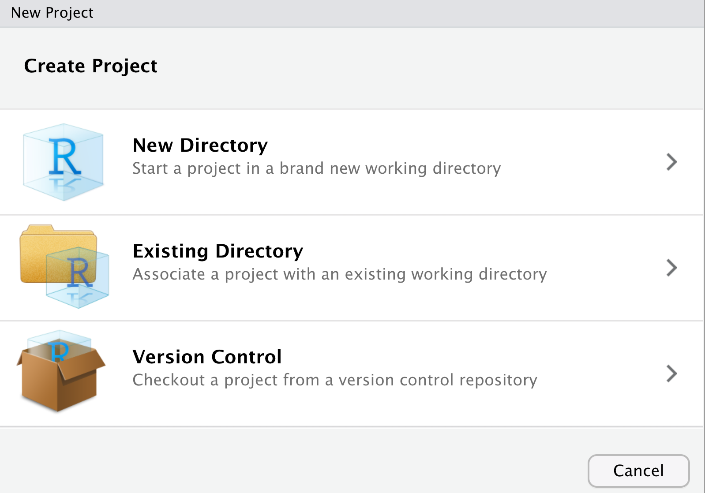
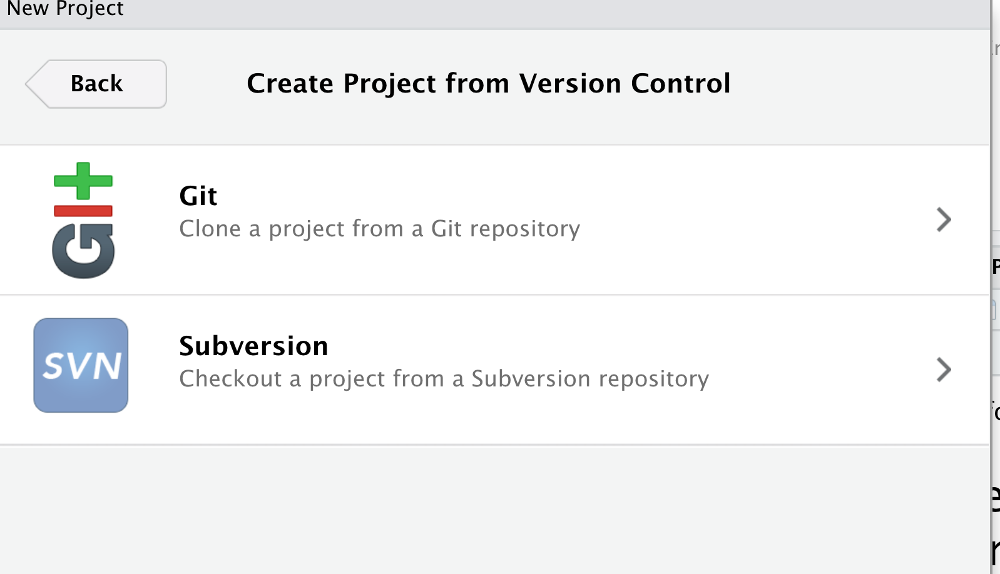
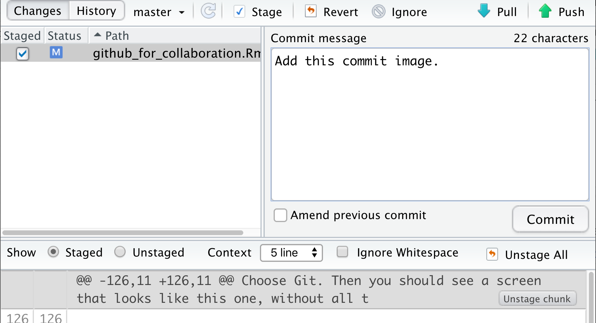
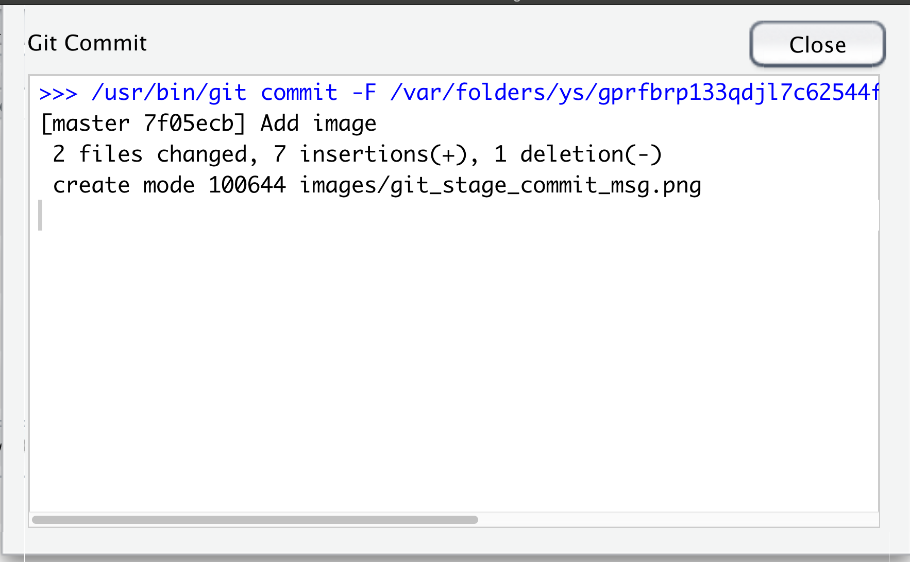
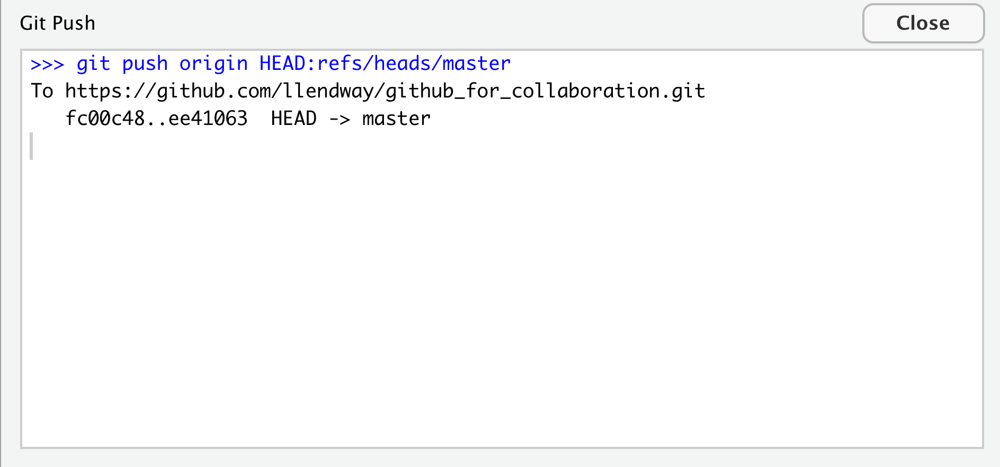
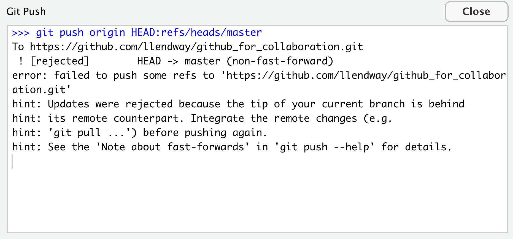
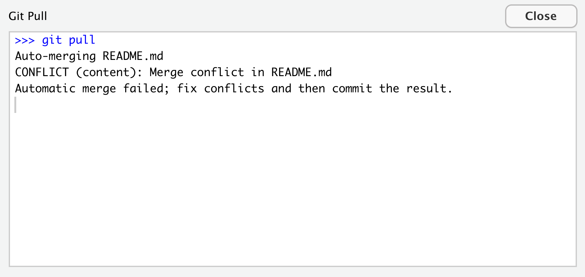

# Disclosure

Much of this material has been adapted from [Happy git with R by Jenny Bryan](https://happygitwithr.com/). It is an excellent resource but contains a lot of information that we don't need for this class. If you want to use Git and GitHub in more advanced ways or if I wasn't clear in my instructions, you should definitely check it out. 

# Video tutorial

<iframe width="560" height="315" src="https://www.youtube.com/embed/QLFc9gw_Hfs" frameborder="0" allow="accelerometer; autoplay; clipboard-write; encrypted-media; gyroscope; picture-in-picture" allowfullscreen data-external="1"></iframe>

[Voicethread tutorial](https://voicethread.com/share/15440257/)

# Git and GitHub

Git is a version control system. It's like Google docs, but accommodates many types of files that Google docs cannot ... like .rmd files! GitHub is an online interface to work with Git. 

Why are we learning these things?!

1. GitHub is well integrated with R Studio. So, we won't need to use any command-line functions, at least not after we have everything set up.

2. You are required to use R for your final project. The presentation or paper needs to be written up as a .rmd document that can be knitted to an html document. Using GitHub will allow you to easily work with your group even when you are not together.

3. GitHub teaches you good habits. You are forced to think about when you save and to make notes about what changes you made each time you do, for example.


# Create a GitHub account

* Go to http://github.com
* Create a username ... see Jenny Bryan's [tips](https://happygitwithr.com/github-acct.html). Incorporate your actual name, use another user name you already have, *pick a username you will be comfortable revealing to a future boss*. Your Macalester username might be a good option. 

# Install & configure Git

  1. Check to see if you already have Git installed. This will only be the case if you have used it somewhere else. To do this, either open the shell or, in R Studio, expand the Console. There should be a tab that says Terminal. In that area type

```
which git
```

If this returns something like

```
/usr/bin/git
```

then you are finished and don't need to install Git. 

On a Windows machine, you may not even be able to type the `which git` command successfully. This should be fixed by installing git. Or you will have to use the shell. You can also try typing `where git`.

  2. If you do not have Git installed, you need to install it. The instructions are slightly different for Windows and Macs.

  **On a Windows:**

  * Install [Git for Windows](https://gitforwindows.org/). When asked about “Adjusting your PATH environment”, make sure to select “Git from the command line and also from 3rd-party software”. Otherwise, we believe it is good to accept the defaults. 
  * R Studio for Windows prefers for Git to be installed below C:/Program Files and this appears to be the default. This implies, for example, that the Git executable on my Windows system is found at C:/Program Files/Git/bin/git.exe. Unless you have specific reasons to otherwise, follow this convention.
  
  **On a Mac:**

  * Go to the *shell/terminal* and enter **one** of these commands to elicit an offer to install developer command line tools. Accept the offer ... click on install.
  
```
git --version
git config
```

  * Some of you on a Mac may need to do the following in the *terminal* if you try to open a project unsuccessfully. You'll find out if this is the case in a moment.
  
```
xcode-select --install
```

  3. Now, go back to the *Console* in R Studio and install the `usethis` package in R Studio. Then, close R Studio and reopen it. 

  4. Load the `usethis` library by running the following piece of code in the *console*: 

```
library(usethis)
```

  5. Run the following code in the *console* with some minor changes. The `user.name` is your Git username. This can be different from your GitHub username, although it might be a good idea to just keep it the same. The `user.email` *MUST* be the same as your GitHub user email. 

```
use_git_config(user.name = "Jane Doe", user.email = "jane@example.org")
```

# Set up a PAT

A PAT, or Personal Access Token, is now necessary (or will be very soon) in order for RStudio and GitHub to talk to one another. Jenny Bryan discusses this is chapter 10 of [Happy Git with R](https://happygitwithr.com/credential-caching.html#credential-caching) and David Keyes discusses it in his [How to Use Git/Github with R](https://rfortherestofus.com/2021/02/how-to-use-git-github-with-r/) blog post (see the Connect RStudio and GitHub section).

1. First, run the `create_github_token()` function from the `usethis` library in the console. This will take you to the GitHub website where you can create a token - store that somewhere safe and don't lose it! You'll need it in a moment and maybe sometime in the distant future.  
2. Install the `gitcreds` package in RStudio and load the library using `library(gitcreds)` (you can do that in the console).  
3. Run the `gitcreds_set()` function in the console. If you are given options, choose the option to Replace these credentials and then paste in your PAT that you just created in the previous step.  
4. When you next commit and push, it may still ask you for your github username and password, **use your PAT when it asks for your password!!**

Let me know if you have issues with any of these steps. My first suggestion will always be to restart your computer. Sadly, I once spent two hours trying to debug git errors only to have them magically fixed when I restarted. Don't be me.

# Create your first repo and use it with R Studio

The word "repo" is short for repository, and that is exactly what it is: a place for things (our files, in this case) to be stored. It is like the folder you created to store all your work for this class. 

Let's go to [GitHub](https://github.com/) and login. After you login, you should see a little icon in the upper right-hand corner. Mine is an image of me. If I click on that a drop-down appears and I can choose "Your repositories". Do that. You should see something like this:


Click on the "New" button. Name your repository `NAME_test_repo`, where `NAME` is actually your name. Choose Public and check the box next to Add a README file. Then click Create repository.



There are things you can do directly within GitHub, but we'll focus on its integration with R Studio. 

# Cloning a repo

Think of cloning a repo as "copying" the repository to your computer. But when it does the copying, it keeps the connection with the online repo. 

Let's do this. On your my_test_repo page, choose the green button that says Code and copy the path by highlighting and clicking the icon that looks like a notebook with an arrow on it. 

Now go to R Studio. Click on File --> New Project ... You should see a window that looks like this:



Choose Version Control. Then you should see a screen that looks like this:



Choose Git. Then you should see a screen that looks like this one, without all the details filled in. The Repository URL is where you should paste the repo URL you cloned from github. It will also populate the Project directory name. Just leave that. **Pay attention** to where the project directory is located and change it to a better directory if appropriate. Click Create Project. 


If you look in the Files tab in the lower right-hand pane of R Studio, you should see the .gitignore file, the project file (ends in .Rproj), and the README.md file. You should also see a Git tab in the upper right-hand pane in R Studio. If you click on the Git tab right now, you won't see anything there.  

With the Git tab open, let's open the README.md file in R Studio. Make a small change to the file by adding the sentence, "I am changing something in this file." Then, click the save icon. When you do this, you will see README.md show up in the Git tab. 

Now, click the Commit button in the Git tab. Put a check in the box next to the README.md file under the word *Staged* (in the future, you can stage multiple files at the same time by checking the boxes next to multiple files) and **add a comment to the commit box**. It should look something like this:



Lastly, click commit. It will give you a message saying it is complete. The message may seem cryptic if you're not used to them. It looks something like this:



The change you made has now been committed (pun intended!) to local memory. The changed file is only change on your computer, NOT online if you look at GitHub ... go check. Click the Diff button in the Git tab and you can see the history of your commits. 

Next, we are going to push those changes to GitHub by clicking the green up arrow in the Git tab. This will give you a message that looks something like this:



Were you prompted for a username and password? Try making another modification, committing, and pushing. Are you still prompted for a username and password? If so, go back and make sure you set up a Personal Access Token (PAT).

**YOUR TURN!!**

1. Add a .rmd file to your project. Do this by going File --> New file --> R Markdown ... Add some words and an R code chunk to the .rmd file. Save it, commit it (don't forget the message!), and push it. Check GitHub online to assure you see the .rmd file there. 

2. Now, knit your file locally. Commit the changes (make sure to put a check next to anything you want staged - .rmd, .html, etc.) and push them to GitHub. Check GitHub online to assure you see everything you expect. 

# Adding collaborators

So far, we've really only learned techniques to use GitHub to manage our own files, but the coolest part about it is its collaboration features. The way we are going to learn about this is adding collaborators to the repo. 

Find someone to partner with in the class. If there is an odd number, create a group of three. In your small group, add each other as collaborators to your project. In GitHub, on the repo page, go to Settings. One of the options on the left is Collaborators. Click on that and do as it says. 

The person who was invited to be a collaborator will receive an email and should also be able to see the invite on GitHub. They need to accept. Once accepted, you should both have access to commit changes to the file.

# Commit --> Push --> Pull --> ... (and Communication)

Once you have added collaborators, all the collaborators can commit and push. But, what happens if someone commits and pushes something and then you go to work on it on your computer ... how do you get those changes? ... PULL!

In your groups, try the following. You should each be collaborators on each other's projects, so you can change roles after doing it once.

1. The collaborator first needs to clone the repo they were asked to collaborate on. If they have another project open, save, commit, and push any changes. Then, close that project and open the project they were asked to collaborate on by cloning the GitHub repo. The collaborator should have the project open in R Studio.  

2. The collaborator should try pulling by clicking the aqua down arrow in the Git tab. You should get a message that looks like this:


3. The person who created the repo makes a change to their .rmd file. It can be a small change, like adding a sentence. That same person saves the file, commits (stage and write a commit message), and pushes it to GitHub. Check online to make sure the most recent changes have been pushed.

4. The collaborator now pulls those changes to their local directory (to their computer). Click the pull icon. You should see a message sort of like this:


And check the file where a change was made to make sure the change is reflected in the file on your computer. 

5. Go back and forth a couple more times making minor changes. The one who owns the repo should make the change and the collaborator should pull it in. Then switch roles. When you switch, be sure you are working with the correct project. 

# Merge conflicts

When you are working on a project together, you are likely to run into a time when two of you are editing the same file at the same time. Sometimes, if you both try to push your changes, you will get what is called a "merge conflict." GitHub won't know which one to use. So, it will force you to decide. 

When you try to push your changes to GitHub and someone else has already pushed their changes regarding the same file, you will get a message like this:



Then, when you do pull in the changes, you will get a message like this:



Notice that it tells you the file where the merge conflict happened. You need to open that file and decide how to merge the conflicting information. It will look something like this at first:


The part after the word `HEAD` is what is in your local file. Everything after the `======` is what is in the remote file (ie. the changes made by your collaborator). You can decide to fix this in any way you want: combine the two ideas, delete both, just keep one, etc. When you are finished, be sure to get rid of the `<<<<<<< HEAD` and `>>>>>>> ` followed by the alphanumeric string, plus any other weird characters.

Then, save the file and do the usual commit and push. You should see the changes pushed out to GitHub.

# Let's try this!

1. In groups of 3-4, practice your GitHub skills.

  a. Choose someone to create a new repo on GitHub called our_collaborative_graph.  
  b. The creator adds the others as collaborators.  
  c. The collaborators should check their email and accept being collaborators.  
  d. The creator and the collaborators clone the repo locally.  
  e. A collaborator adds a .rmd file to the project locally. The title should be "Our graph" and add all the group members as authors. Add an R code chunk that loads the `tidyverse` librarary. Save the file, commit with message, and push to GitHub. Check online to assure it was pushed properly.  
  f. All other group members pull the changes locally.  
  g. A different collaborator adds another R code chunk. With the *mpg* dataset, create a scatterplot with *hwy* on the y-axis, *displ* on the x-axis and color the points by *drv*. Save changes. Knit the file. Then commit with message and push to GitHub. Make sure you stage all files in the commit. Check online to assure you see the changes.  
  h. All other group members pull the changes locally.  
  i. Another group member (either collaborator or creator if you only have 3 group members) modifies the R code chunk that creates the graph, adding nice x and y labels and changing to `theme_minimal()`. Save changes. Knit the file. Then commit with message and push to GitHub. Make sure you stage all files in the commit. Check online to assure you see the changes.   
  j. All grop members pull. The one who just pushed should see that they are already up to date. All others should see the changes reflected locally.   
  k. Now, all group members should add something to the .rmd file. Don't tell each other what you're adding. When you are finished, save, knit, commit, and push to GitHub. At least one of you will get a merge conflict, so it will ask you to pull in changes from GitHub and fix the conflict. Do that. This time you will have to modify the .rmd file rather than the README like I showed earlier.  
  
2. If you finish, 112 students should set up a project with their actual group project members. Include a .rmd file called something like "ideas.rmd" where you can share ideas, including topics and data you might be interested in analyzing. 155 students should take the group project survey on the moodle page. 

# Resource

[Happy git with R by Jenny Bryan](https://happygitwithr.com/): great resource although it references the command line quite a bit


